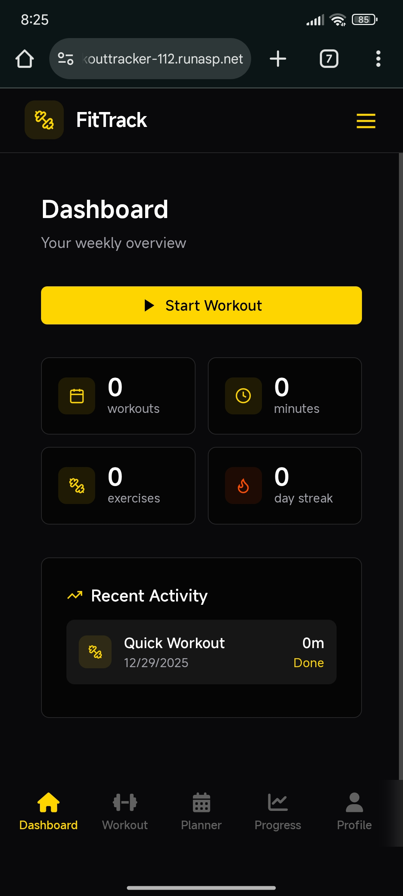
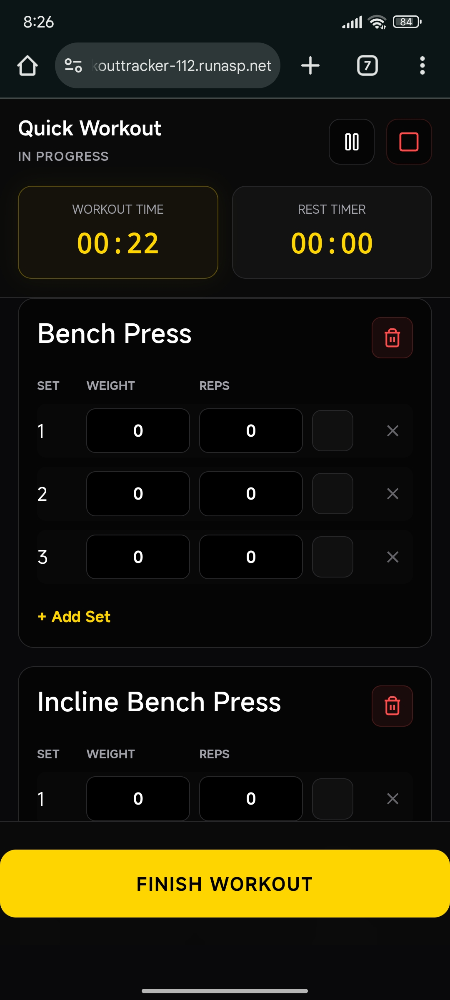
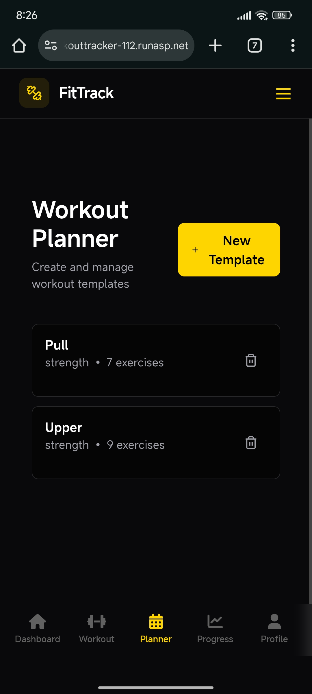
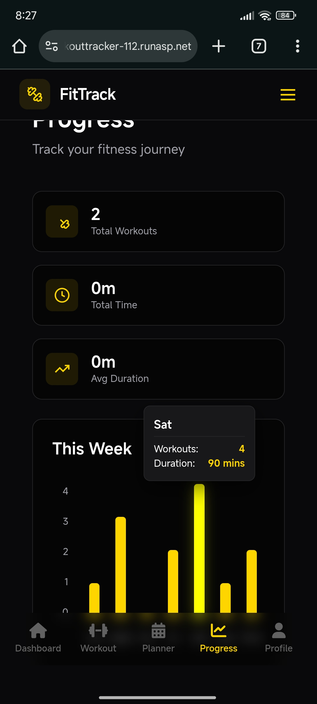

# WorkoutTracker

A full-stack workout tracking web application to log, view, and analyze your fitness routines.

**Backend**: .NET (C#) API  
**Frontend**: HTML + CSS + JavaScript  
**Architecture**: RESTful API + static frontend

## ✨ Features

- Create, read, update, and delete workout sessions
- Log exercises with sets, reps, weight, and notes
- View workout history and basic statistics
- Simple, clean, responsive user interface
- (planned) User authentication & multiple profiles
- (planned) Progress charts and export functionality

## 📸 Screenshots

<div align="center">
  
  
  
  
</div>

<p align="center"><em>FitTrack on mobile (dark theme)</em></p>

## 🛠️ Tech Stack

- **Backend**  
  - .NET 8   
  - ASP.NET Core Web API  
  - Entity Framework Core

- **Frontend**  
  - HTML5  
  - CSS3
  - JavaScript

- **Tools**  
  - Visual Studio 
  - Git
  - MSSQL

## 🚀 Getting Started

### Prerequisites

- [.NET SDK](https://dotnet.microsoft.com/download) (version 6.0 or higher)
- A modern web browser
- (optional) Visual Studio 2022+ with .NET desktop/web development workload

### Installation

1. Clone the repository

```bash
git clone https://github.com/Saran172/WorkoutTracker.git
cd WorkoutTracker
